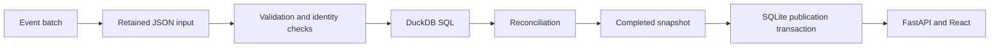

# Architecture

Relay processes a complete batch on one host. SQLite owns durable run state and the current publication pointer. DuckDB performs analytical transformations. Raw input and completed snapshots are retained on the local filesystem. FastAPI exposes the processing controls and results to React.

## Processing

[Event](../relay/domain.py) validates the envelope and typed payload. Money uses integer cents; timestamps require an offset and are normalized to UTC. Identity is `(source, event_id)`. Business content is hashed independently of arrival time so an identical delivery can be recognized even when it arrives later.

[evaluate()](../relay/engine.py) groups events by identity. Identical variants retain one deterministic representative. Conflicting variants are quarantined. Cross-event checks resolve orders, payments, refunds, shipments, and historical product attributes. Invalid or unresolved input remains available for inspection and blocks publication under the current contract.

The engine builds normalized tables, calculates SQL reports, and compares them with an independent Python calculation. The candidate report includes checks, exceptions, totals, lineage, and a business fingerprint. A valid candidate can produce a report and five Parquet tables.

## Run control and publication

[Store](../relay/store.py) maintains `control.sqlite3` plus `raw`, `staging`, and `snapshots` directories. Raw files are addressed by content hash. A request key prevents duplicate submissions; reusing a key with a different request is rejected.

Runs move from `queued` to `running`, then to `published`, `blocked`, `failed`, or `cancelled`. A file lock serializes writers on the same host. The application has one background worker; concurrent requests can enter the durable queue while it processes a batch.

Publication completes and synchronizes files in staging, writes the manifest, and renames the complete directory into the snapshot location. A SQLite transaction then updates the publication pointer and run state. Staging and snapshots must share a filesystem for the rename.

SQLite and the filesystem do not share a transaction. A failure before pointer commit may leave an unreferenced complete snapshot, which is detected as an orphan. The previous publication remains available. A retry validates the retained input and creates a new run with `parent_id`; it rebuilds the batch rather than resuming a partially completed transformation. Cancellation is cooperative at processing boundaries.

## API and interface

[create_app()](../relay/api.py) starts the local worker and defines the HTTP API. The browser polls run status and preserves already loaded results when a refresh fails. The default server binds to loopback. Mutation origins are restricted to the supported local UI origins; this is not multi-user authentication.

| Endpoint | Purpose |
|---|---|
| `GET /api/overview` | Current publication summary and recent runs |
| `POST /api/runs` | Queue a scenario batch using an idempotency key |
| `GET /api/runs/{id}` | Inspect a run and its candidate results |
| `POST /api/runs/{id}/retry` | Create a child from retained input |
| `POST /api/runs/{id}/cancel` | Request cancellation |
| `GET /api/orders` | Search and page through published orders |
| `GET /api/compare` | Compare two published snapshots |
| `GET /api/benchmarks` | Read saved measurements |

Complete route schemas are available at `/docs` while the local server is running.

[client.ts](../web/src/client.ts) presents the same typed interface for local API responses and the recorded JSON bundle. The public build selects recorded mode at build time. Its controls open saved evidence; run creation, cancellation, and retry are only available locally.

## Code map

| File | Responsibility |
|---|---|
| [domain.py](../relay/domain.py) | Event and payload contracts, canonicalization, hashes |
| [scenarios.py](../relay/scenarios.py) | Deterministic synthetic batches and failure cases |
| [engine.py](../relay/engine.py) | Validation, transformations, checks, report artifacts |
| [reporting.sql](../relay/sql/reporting.sql) | Daily financial and inventory reports |
| [store.py](../relay/store.py) | Queue, retained input, snapshots, publication, recovery |
| [api.py](../relay/api.py) | Local API and worker lifecycle |
| [cli.py](../relay/cli.py) | Run, serve, export, verify, and benchmark commands |
| [App.tsx](../web/src/App.tsx) | Investigation screens and shared components |
| [tests](../tests) | Domain, pipeline, recovery, and API checks |

## Current constraints

Each scenario is a self-contained batch. Corrections and retries rebuild that batch. Reports are loaded from JSON before API pagination; larger datasets will need a queryable detail store. Retention and orphan cleanup are manual. Network filesystems and multi-host scheduling are outside the supported topology.
