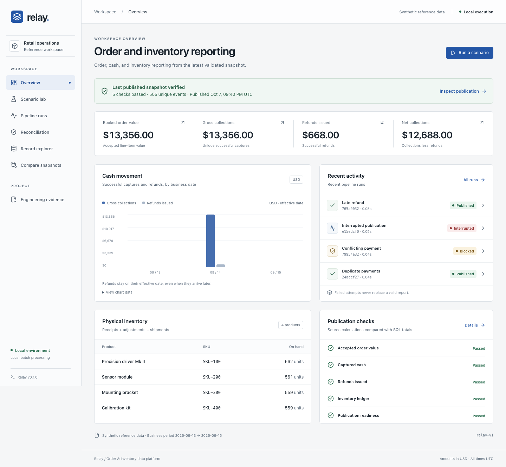

# Relay: order and inventory reporting

[Explore the recorded demo](https://relay-data-operations.binyam267285.chatgpt.site) · [Source and tests](https://github.com/BinyamAbraha/relay)

Relay reconciles orders, payments, refunds, and inventory when events are duplicated, delayed, or conflicting. It also handles interrupted processing without replacing the last valid report.

The implementation runs on one host using Python, DuckDB, Parquet, SQLite, and React. The public demo displays saved results from local runs over synthetic data. Processing and run controls are available in the local application.

## Business rules

Repeated delivery must not count a payment twice. Interrupted processing must not expose partial output. Relay publishes a new snapshot only after all output files are complete and the configured business checks pass.

Money is stored as integer cents. An order for two units at 2,500 cents has booked value 5,000 cents; a 5,000-cent payment creates collections; a later 2,500-cent refund reduces net collections but does not put an item back into stock. The distinction is explicit in the [product contract](../product-contract.md).

## Architecture

```mermaid
flowchart LR
  A[Synthetic event batch] --> B[Retained raw input + checksum]
  B --> C[Validate, deduplicate, resolve relationships]
  C --> D[DuckDB SQL + independent reconciliation]
  D --> E[Run-specific staging]
  E --> F[Complete immutable snapshot]
  F --> G[SQLite publication transaction]
  G --> H[FastAPI + React investigation]
  H --> I[Recorded JSON export + static React demo]
```

SQLite records requests, state transitions, retry lineage, and the active publication. DuckDB performs analytical transformations. The filesystem retains raw inputs and completed artifacts. These components have different responsibilities; SQLite and the filesystem do not share a transaction.

The process writes and completes output before moving the publication pointer. A failure before that transaction may leave an unreferenced snapshot, which the application detects. It leaves the previous publication available. Retrying uses the checksummed retained input and creates a linked child run.

## Design decisions

| Decision | Benefit | Cost or boundary |
|---|---|---|
| Identity is `(source, event_id)` | Replayed deliveries do not change the business result | The source must provide meaningful identities |
| Conflicting content is quarantined | No arbitrary overwrite of a financial fact | An operator must resolve conflicts upstream |
| Event time differs from arrival time | Late cash flows land in the appropriate business period | This version recomputes the whole batch |
| Validate before publication | Incomplete or invalid candidates cannot replace valid evidence | Staging and old snapshots consume disk space |
| Independent ledger reconciliation | Checks SQL results against a separate calculation | Both calculations still depend on the documented business contract |
| One local worker and SQLite | Reproducible setup with no external service bill | No multi-host scheduling or multi-user service claim |
| Static recorded demo | Reviewers can inspect evidence without installing a backend | Controls inspect saved runs; they do not execute processing |

## Verification

Verification includes 39 backend tests, 10 local browser journeys, and 2 static-demo browser tests. Tests include hand-calculated financial fixtures, generated replay/permutation cases, conflicting identities, missing prerequisites, retained-input tampering, concurrent identical submissions, and a real worker-process exit at the publication boundary. Browser checks cover recovery, record lineage, stale and empty states, narrow layouts, and scanned accessibility rules. See the [verification record](../evidence/verification.md) for exact commands and the additional public-release checks.

A reviewer can compare a baseline with repeated delivery, inspect a blocked conflict, and follow a failed run to a successful retry. Each result links to the run details used to produce it.

## Measured optimization

Replacing repeated row insertion with bulk JSON loading into DuckDB reduced the median measured time for 15,464 events from **12.7283 seconds to 0.5571 seconds** across three fresh subprocesses per size, about **22.8×**. The comparable business fingerprint stayed the same. Maximum observed peak RSS increased from **171.4 MiB to 258.5 MiB** for that workload.

The larger final workload processed **102,009 synthetic events in a median 4.0762 seconds**, with maximum observed peak RSS **988.5 MiB**. This measurement covers generation, validation, SQL, and report assembly on an Apple Silicon M4 Mac mini. It excludes imports, disk persistence/publication, API, and browser work. OS cache state was uncontrolled; it is not an end-to-end latency or production throughput claim. [Raw evidence and methodology](../benchmarks.md).

## Relevance and limits

The project covers event identity, schema validation, lineage, reconciliation, consistent publication, recovery, and performance measurement.

The implementation uses synthetic USD data, one warehouse, and full-batch processing on one host. It does not establish production experience, cloud operations, distributed scale, authentication, or incremental correctness. A planned extension is incremental recomputation: recalculate affected partitions and compare the result with a full rebuild.
